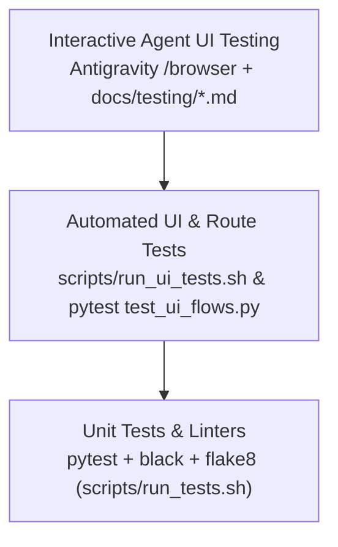

# Testing Guide & UI Verification Framework

This document outlines the testing architecture, automated verification pipelines, and Antigravity `/browser` test runbooks for the `travel-assistant` repository.

---

## 1. The Testing Pyramid

Testing in `travel-assistant` is structured across three complementary tiers:



| Tier | Tool / Runner | Purpose | Execution Frequency |
| :--- | :--- | :--- | :--- |
| **Unit & Lints** | `bash scripts/run_tests.sh` | Unit test models, API validators, sync engines, and enforce code style (`black`, `flake8`). | Pre-commit / Pre-PR |
| **Automated UI / DOM** | `bash scripts/run_ui_tests.sh` | Fast route scanning, static asset integrity, Grid.js JSON payloads, and British English linter. | Pre-commit / Pre-PR |
| **Full Pipeline** | `bash scripts/verify_all.sh` | Runs unit tests, automated UI tests, and Docker container packaging validation. | Mandatory Pre-PR |
| **Agent UI Testing** | `/browser` in Antigravity | Exploratory, visual layout, responsive, and end-to-end interactive journey testing. | During development |

---

## 2. Sample Database for Testing

To facilitate rich exploratory testing without external API credentials, a sample database generator is provided:

```bash
# Generate / reset the sample SQLite database
bash scripts/seed_sample_db.sh

# Run the local development server against the sample database
bash scripts/run_dev.sh --sample-db
```

The sample dataset includes:
* **UK Rail Stations**: London King's Cross (`KGX`), London St Pancras (`STP`), London Euston (`EUS`), Manchester Piccadilly (`MAN`), Edinburgh Waverley (`EDB`).
* **Bus Stops & Routes**: TfL bus stops (`490000077E`, `490000077W`, `490000077C`) and routes (73, 30, 205).
* **Locations**: Home Assistant zones (`zone.home`, `zone.work`, `zone.gym`) and custom places (`custom:central_library`, `custom:community_centre`, `custom:parents_house`).
* **Timetables**: Configured weekday and weekend transit schedules.
* **Transfers**: Inter-station walking links and within-station platform transfer times.
* **Journeys**: Configured multi-leg travel routes with target arrival times.

---

## 3. Antigravity `/browser` UI Test Runbooks

For interactive browser testing sessions with Antigravity, refer to the modular scenario runbooks in [`docs/testing/`](docs/testing/):

1. [**01_credentials.md**](docs/testing/01_credentials.md): API credentials configuration, password masking, and live asynchronous validator feedback.
2. [**02_locations.md**](docs/testing/02_locations.md): Custom places, geographic coordinate validation, Home Assistant zone read-only protection, and place search autocomplete.
3. [**03_timetables.md**](docs/testing/03_timetables.md): Transit timetable creation, operating day-of-week selection, and date validity constraints.
4. [**04_transfers.md**](docs/testing/04_transfers.md): Station-to-station walking connections, platform transfer durations, and step-free accessibility indicators.
5. [**05_journeys.md**](docs/testing/05_journeys.md): Multi-leg journey definitions, origin/destination pickers, and trip time window configuration.
6. [**06_ingress_and_theme.md**](docs/testing/06_ingress_and_theme.md): Home Assistant Ingress `X-Ingress-Path` prefixing, responsive mobile layout, and dark/light theme ergonomics.

### Running `/browser` with Remote Debugging
On Linux / container environments, initialise the browser debugging process:

```bash
# Start headless Chromium with remote debugging on port 9222
bash scripts/start_browser_debug.sh

# Launch the app with sample data
bash scripts/run_dev.sh --sample-db
```

Then in Antigravity chat, run:
```text
/browser Execute the scenarios described in docs/testing/02_locations.md on http://localhost:8099
```

---

## 4. Mandatory Pre-Push Verification

Before opening any GitHub Pull Request, ensure that all tests and lints pass:

```bash
bash scripts/verify_all.sh
```
