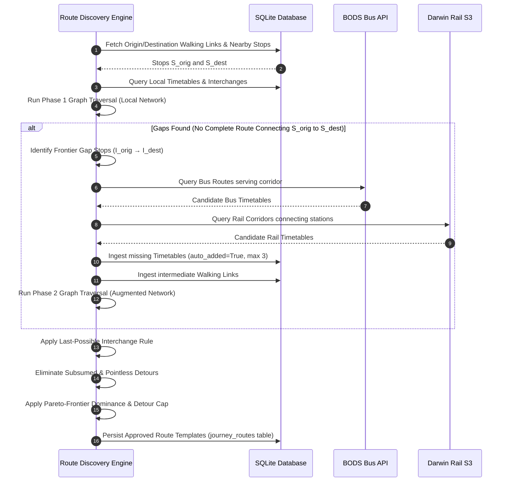

# Route Planning Engine — Architecture & Technical Specification

This document provides the canonical architectural and technical specification for the **Route Planning Engine** in Travel Assistant. It serves as the authoritative blueprint for developers and AI agents implementing Tier 1 topological Route Template discovery and Tier 2 real-time journey trip dispatching.

---

## 1. Scope & System Architecture

The Route Planning Engine is structured around a strict **two-tier separation of concerns** to maintain high performance, avoid unnecessary minute-by-minute timetable simulations during configuration, and provide deterministic, sensible travel corridors.

```mermaid
graph TD
    subgraph "Tier 1: Route Template Discovery (Static / Structural)"
        A[Configured Journey: Origin → Destination] --> B[Multi-Modal Transit Graph Builder]
        B --> C[Phase 1: Local Network Traversal]
        C --> D{Viable Route Found?}
        D -- No / Corridor Gaps --> E[Phase 2: External Timetable Ingestion<br/>(BODS / Darwin)]
        E --> B
        D -- Yes --> F[Route Pruning & Optimisation Engine]
        F --> G[Pareto-Frontier & Detour Filtering]
        G --> H[(Persisted Route Templates Database)]
    end

    subgraph "Tier 2: Real-Time Trip Dispatcher (Dynamic / Live)"
        H --> I[Real-Time Journey Calculator]
        J[Live Departure Boards / Darwin LDB / GPS] --> I
        K[Active Journey Time Window] --> I
        I --> L[Concrete Dispatched Trips<br/>e.g. 08:04 Train → 08:25 Bus]
    end
```

### 1.1. Tier 1: Route Planning (Route Level)
- **Role**: Discovers, optimises, and persists structural **Route Templates**.
- **Inputs**: Origin, Destination, transit stops, timetable stop sequence matrices, operating day masks (`monday`...`sunday`), operating time windows, walking connections (`walking`), and station platform transfers (`platform_transfers`).
- **Output**: A ranked set of distinct, viable topological route corridors stored in the `journey_routes` table.
- **Key Property**: Operates at the network corridor level without simulating individual trip schedules minute-by-minute.

### 1.2. Tier 2: Real-Time Journey Dispatching (Trip Level)
- **Role**: Dispatches concrete, scheduled travel trips against active Route Templates.
- **Inputs**: Active `JourneyRoute` templates, real-time departure feeds (Darwin Live, BODS SIRI-VM), current date/time, and user-configured arrival/departure time constraints.
- **Output**: Specific scheduled services (e.g. *08:14 Bus 73 arriving at 08:35, transferring at 08:42 to Great Northern Train*), delay adjustments, platform indicators, and Home Assistant sensor entity updates.

### 1.3. Unidirectional Guarantee
- All journeys and route templates are strictly **unidirectional** ($\text{Origin} \rightarrow \text{Destination}$).
- Reverse routes are not inferred or mirrored. Return journeys must be configured as distinct journey entries with their own origin, destination, and schedule settings.

---

## 2. Graph Model & Multi-Modal Network Topology

### 2.1. Graph Nodes
- **Places / Locations**:
  - Home Assistant zones (`ha:<object_id>`)
  - Custom locations (`custom:<id>`)
- **Transit Access Nodes / Stops**:
  - Rail stations (`rail`)
  - Bus stops (`bus`)
  - Metro and tram stops (`metro`, `tram`)
  - Ferry terminals (`ferry`)

### 2.2. Graph Edges
1. **Walking Edges** (`walking` table):
   - Places $\leftrightarrow$ Transit Stops (e.g. Home $\rightarrow$ Bus Stop A)
   - Transit Stops $\leftrightarrow$ Transit Stops (e.g. Inter-station / street transfer between Stop C and Stop C')
   - Places $\leftrightarrow$ Places (e.g. Direct walking journey from Home $\rightarrow$ Office)
   - Carries walking duration in minutes and directional/bidirectional flags.
2. **Platform Transfer Edges** (`platform_transfers` table):
   - Intra-station interchange times between specific rail platforms (e.g. Platform 1 to Platform 8 at King's Cross) with step-free accessibility flags.
3. **Scheduled Transit Edges** (`timetables` table):
   - Directed transit corridors between Stop $A \rightarrow$ Stop $B$ where Stop $B$ appears chronologically after Stop $A$ in a timetable's stop sequence matrix.
   - Associated with operating day masks, service validity date ranges, and typical run times.

### 2.3. Modal Staging Hierarchy & Transfer Limits

```
[Journey: Origin → Destination]
 ├── Stage 1: Walk (Origin → Bus Stop A)
 ├── Stage 2: Bus Modal Stage (Up to 3 intra-modal transfers: Bus 1 → Bus 2 → Bus 3)
 ├── Stage 3: Walk / Station Transfer (Bus Stop C → Rail Station X)
 ├── Stage 4: Rail Modal Stage (Up to 3 intra-modal transfers: Train 1 → Train 2 → Train 3)
 ├── Stage 5: Bus Modal Stage (Up to 3 intra-modal transfers: Bus 4 → Bus 5)
 └── Stage 6: Walk (Final Stop → Destination)
     ↳ Total: 5–6 Modal Stages, containing up to 8–10 total transit changes
```

To enable complex rural/regional journeys while avoiding exponential graph search explosion, the engine enforces two structural limits:
- **Macro Stage Limit**: Up to **6 modal stages** per journey (e.g. `Walk` $\rightarrow$ `Bus Stage` $\rightarrow$ `Rail Stage` $\rightarrow$ `Bus Stage` $\rightarrow$ `Walk`).
- **Intra-Modal Transfer Limit**: Each modal stage can contain up to **3 transfers** (e.g. up to 4 consecutive bus rides within a single bus stage).
- **Composite Capacity**: Realistically accommodates composite journeys with **8 or more total transfers** across distinct transport modes.
- **Corridor Bounding**: Intermediate stop exploration is restricted to a geographic bounding corridor between Origin and Destination with a configurable buffer (default: 5 km margin).

---

## 3. Two-Phase Route Discovery Workflow



### 3.1. Phase 1: Local Network Traversal
1. Identify all transit stops within walking distance of Origin ($\mathcal{S}_{\text{orig}}$) and Destination ($\mathcal{S}_{\text{dest}}$).
2. Execute a constrained $K$-Shortest Paths / Breadth-First Search (BFS) over the local graph:
   - Track active modal stage count ($\le 6$) and intra-modal transfer count ($\le 3$).
   - Compute cumulative estimated travel durations and active operating day masks.
3. If valid routes are discovered that cover the Journey's active time settings, the engine proceeds directly to the Pruning & Optimisation phase.

### 3.2. Phase 2: External Timetable Ingestion
If no continuous path connects $\mathcal{S}_{\text{orig}}$ to $\mathcal{S}_{\text{dest}}$:
1. **Frontier Gap Analysis**: Identify the reachable forward stop frontier from Origin ($\mathcal{I}_{\text{orig}}$) and reachable reverse stop frontier from Destination ($\mathcal{I}_{\text{dest}}$).
2. **Corridor Bounded Query**:
   - Query **BODS REST API** for bus lines serving stops in $\mathcal{I}_{\text{orig}}$ that travel towards $\mathcal{I}_{\text{dest}}$ within the geographic corridor.
   - Query **Darwin S3 / Live** for rail routes connecting intermediate stations.
3. **Safety Cap & Ingestion**:
   - Automatically download and ingest up to **3 candidate intermediate timetables** (`auto_added=True`).
   - Reconcile intermediate walking links between adjacent stops if required.
4. **Augmented Graph Search**: Re-execute graph traversal over the updated local database.

---

## 4. Pruning, Deduplication & Optimisation Rules

The engine applies four formal pruning rules in sequence to eliminate redundant, illogical, or strictly inferior route options:

### Rule 1: Last Possible Interchange Point
When transferring from Route 1 to Route 2 where Route 1 serves stops $[A, B, C, D, E]$ and Route 2 serves stops $[C, D, E, F, G]$, the transfer **MUST occur at Stop $E$** (the furthest common stop along the travel direction).

```
Route 1: (A) ===> (B) ===> (C) ===> (D) ===> [E]  (Stay on board until E)
                                              |   (Single interchange)
Route 2:                   (C)     (D)       [E] ===> (F) ===> (G)
```

- **Walking Extension**: If interchange involves consecutive transferable stop pairs connected by walking links (e.g. Stop $C \leftrightarrow C'$, Stop $D \leftrightarrow D'$, Stop $E \leftrightarrow E'$), the latest reachable interchange along Route 1 is chosen.
- **Objective**: Prevents route duplication (avoiding 3 identical routes changing at $C$, $D$, and $E$) and maximises comfortable in-vehicle travel time.

### Rule 2: Elimination of Subsumed / Pointless Detours
A candidate route that replaces a sub-segment of an existing continuous transit line with an unnecessary transfer is strictly eliminated.
- *Example*: Disembarking a train at $B$, taking a bus to $C$, and re-boarding a train to $D$ when the train already operates directly from $A \rightarrow D$ is pruned as a pointless detour.

### Rule 3: Pareto-Frontier Dominance Filtering
A route candidate $R_a$ dominates another route candidate $R_b$ if:
$$\text{Duration}(R_a) \le \text{Duration}(R_b) \quad \text{AND} \quad \text{Transfers}(R_a) \le \text{Transfers}(R_b)$$
with at least one strict inequality across all active Journey time windows. Dominated routes are discarded unless they provide unique time coverage during windows when the dominating route does not operate.

### Rule 4: Senseless Detour Threshold
Any candidate route whose estimated total travel duration exceeds **1.5$\times$ the duration of the fastest alternative** (or adds more than **30 minutes** without offering unique time-window coverage) is pruned as a senseless geographic detour.

---

## 5. Database Schema & Data Models

### 5.1. `JourneyRoute` Model (`journey_routes` table)

```python
"""Peewee model for discovered and configured journey route templates."""

from typing import Any, Dict, List, Optional
from peewee import AutoField, BooleanField, CharField, IntegerField, TextField

from app.models.base import BaseModel, PydanticField


class JourneyRoute(BaseModel):
    """Discovered or custom route template for a configured Journey."""

    id = AutoField()
    journey_id = IntegerField(index=True)
    name = CharField()
    is_preferred = BooleanField(default=False)
    is_enabled = BooleanField(default=True)
    auto_generated = BooleanField(default=True)
    total_duration_est_minutes = IntegerField(default=0)
    transfer_count = IntegerField(default=0)
    stages_count = IntegerField(default=1)
    primary_mode = CharField(default="bus")
    legs = PydanticField(model_type=List[Dict[str, Any]], default=list)
    active_days = PydanticField(model_type=List[str], default=list)
    summary_text = TextField(null=True)

    class Meta:
        table_name = "journey_routes"
        indexes = (
            (("journey_id", "is_enabled"), False),
        )
```

### 5.2. Structured `legs` JSON Format

```json
[
  {
    "stage_index": 1,
    "step_index": 1,
    "leg_type": "walk",
    "from_type": "ha",
    "from_id": "ha:home",
    "from_name": "Home",
    "to_type": "bus",
    "to_id": "atco:490000077E",
    "to_name": "King's Cross Station (Stop E)",
    "duration_minutes": 8,
    "distance_m": 520
  },
  {
    "stage_index": 2,
    "step_index": 2,
    "leg_type": "transit",
    "transport_mode": "bus",
    "line_name": "73",
    "operator_name": "Arriva London",
    "from_type": "bus",
    "from_id": "atco:490000077E",
    "from_name": "King's Cross Station (Stop E)",
    "to_type": "bus",
    "to_id": "atco:490000077C",
    "to_name": "Euston Station (Stop C)",
    "duration_minutes": 14,
    "stops_count": 5,
    "timetable_id": 4
  },
  {
    "stage_index": 3,
    "step_index": 3,
    "leg_type": "walk",
    "from_type": "bus",
    "from_id": "atco:490000077C",
    "from_name": "Euston Station (Stop C)",
    "to_type": "ha",
    "to_id": "ha:work",
    "to_name": "Tech Campus",
    "duration_minutes": 6,
    "distance_m": 410
  }
]
```

---

## 6. User Interface & Configuration Experience

### 6.1. Journeys View (`/config/journeys`)
- **Expandable Route Cards**: Each Journey card features an expandable "Discovered Routes" section displaying all available Route Templates.
- **Visual Step Sequence**: Visual pill sequence (e.g. `🚶 8m` $\rightarrow$ `🚌 73 (14m)` $\rightarrow$ `🚶 6m`) with total estimated duration (`28 mins`) and transfer count (`0 changes`).
- **User Actions**:
  - **Enable / Disable Toggle**: Toggle individual routes on or off (disabled routes are ignored by the real-time departure solver).
  - **Set Preferred**: Mark a preferred route with a star icon to prioritise it on Home Assistant dashboards.
  - **Re-discover Routes Button**: Triggers the two-phase route discovery engine on demand with visual progress feedback.

---

## 7. Implementation Roadmap for Future Tasks

1. **Service Layer & Graph Algorithms**:
   - Implement `RoutePlannerService` in `app/services/route_planner.py`.
   - Build multi-modal graph representation from `Walking`, `PlatformTransfer`, and `Timetable` models.
   - Implement the Last-Possible Interchange, Subsumed Detour, and Pareto-Dominance pruning algorithms.
2. **Intermediate Timetable Ingestion**:
   - Implement corridor gap detection and automated external timetable retrieval from BODS and Darwin S3.
3. **Data Model Integration**:
   - Add `JourneyRoute` model into `app/models/journey.py` and register in `app/db/core.py`.
   - Wire route discovery into Journey save actions and background worker sync loops.
4. **UI Integration**:
   - Update `travel-assistant/app/templates/config_journeys.html` and `travel-assistant/app/views/config/journeys.py` with route cards and interactive controls.
5. **Testing & Verification**:
   - Add comprehensive unit and UI tests verifying multi-modal chaining, pruning rules, and gap resolution.
