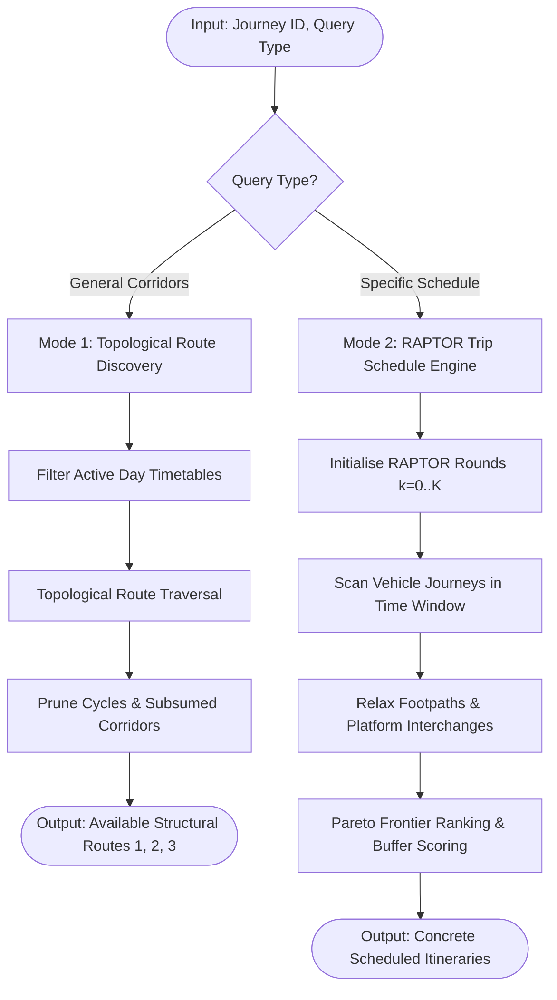

# Multi-Modal Journey Routing & Planning Process Specification

## 1. Executive Summary & Dual-Mode Planning

This specification defines the canonical, programmatic process for computing multi-modal transit routes and concrete itinerary plans to fulfill any user-configured `Journey` in the Travel Assistant database (`travel_assistant.db`).

The process operates **purely from SQLite database tables** and supports **two complementary planning modes** using the same underlying multi-modal transit graph:

```
                          ┌─────────────────────────────────────┐
                          │    Multi-Modal Transit Database     │
                          │        (travel_assistant.db)        │
                          └──────────────────┬──────────────────┘
                                             │
             ┌───────────────────────────────┴───────────────────────────────┐
             ▼                                                               ▼
┌──────────────────────────────┐                               ┌──────────────────────────────┐
│     Mode 1: Route Discovery  │                               │    Mode 2: Journey Planning  │
│     (Structural Corridors)   │                               │     (Specific Itineraries)   │
├──────────────────────────────┤                               ├──────────────────────────────┤
│ • "A to B is possible via    │                               │ • "Leaving now at 07:30"     │
│   Corridors 1, 2, or 3"      │                               │ • "Arriving by 09:00"        │
│ • Time-independent topology  │                               │ • "Departing between 16–18h" │
│ • Discovers invariant paths: │                               │ • Binds concrete trips &     │
│   Walk → SB1 → Train → Shuttle│                               │   timings to active corridors│
└──────────────────────────────┘                               └──────────────────────────────┘
```

---

## 2. Dual-Mode Operation: Routes vs Specific Plans

### 2.1. Mode 1: General Route Discovery (Topological Corridors)
* **Question Answered**: *"What distinct corridors exist to travel from Location A to Location B across the transit network?"*
* **Evaluation**: Time-Independent / Day-Mask Level.
* **Process**:
  1. Identifies reachable stops from Origin ($A_{origin}$) and Destination ($A_{dest}$) via `walking`.
  2. Traverses timetable stop sequence matrices in `timetables` and transfers in `stop_interchanges` topologically (treating each timetable as a directed sequence of stops without fixing specific trip times).
  3. Finds all distinct non-cyclic corridor paths $C = (L_1, L_2, \dots, L_m)$ where $L_i$ represents a transit line, walking transfer, or platform interchange.
* **Resulting Output**:
  * **Corridor 1**: `Walk (Home → King's Cross Stop E) → Bus 73 → Walk (Euston Stop C → Tech Campus)`
  * **Corridor 2**: `Walk (Home → London King's Cross) → Train (King's Cross → London Euston) → Walk (Euston → Tech Campus)`

---

### 2.2. Mode 2: Specific Journey Planning (Time-Dependent Itineraries)
* **Question Answered**: *"Give me concrete plans for leaving now at 07:30, arriving by 09:00, or travelling in window 16:00–18:00."*
* **Evaluation**: Time-Dependent Trip Binding.
* **Variants Supported**:
  1. **"Leaving Now / Depart at $T$" (Forward Search)**:
     * Sets $t_{start} = T$, runs forward RAPTOR to find earliest arrival and subsequent departure options.
  2. **"Arrive by $T$" (Backward Search / Latest Departure)**:
     * Sets $t_{target} = T$, runs backward RAPTOR or evaluates candidate trips in reverse to find the latest valid departure from origin that guarantees arrival $\le T$.
  3. **"Time Window $[T_1, T_2]$" (Range-RAPTOR / rRAPTOR)**:
     * Evaluates trips departing within $[T_1, T_2]$, generating the Pareto-optimal set of options across the window.
* **Resulting Output**: Exact minute-by-minute itinerary (e.g. *Depart 08:00 $\rightarrow$ 08:08 Bus 73 $\rightarrow$ 08:22 Walk $\rightarrow$ Arrive 08:28*).


---

## 3. Database Data Model & Source Mapping

The planning process organises and utilises six core tables in `travel_assistant.db`:

```
                               ┌───────────────────────────┐
                               │         journeys          │
                               │ (Origin, Dest, Windows)   │
                               └─────────────┬─────────────┘
                                             │
             ┌───────────────────────────────┼───────────────────────────────┐
             ▼                               ▼                               ▼
   ┌───────────────────┐           ┌───────────────────┐           ┌───────────────────┐
   │      walking      │           │    timetables     │           │ stop_interchanges │
   │ (Location ↔ Stop) │           │ (Stops & Trips)   │           │ (Stop ↔ Stop)     │
   └─────────┬─────────┘           └─────────┬─────────┘           └─────────┬─────────┘
             │                               │                               │
             └───────────────────────┬───────┴───────────────────────────────┘
                                     ▼
                       ┌───────────────────────────┐
                       │           stops           │
                       │ (ATCO, Name, Lat/Lon, BNG)│
                       └─────────────┬─────────────┘
                                     ▼
                       ┌───────────────────────────┐
                       │     platform_transfers    │
                       │ (Platform-specific, opt)  │
                       └───────────────────────────┘
```

### 3.1. Table Schemas & Extracted Fields

| Table | Relevant Fields | Process Role |
| :--- | :--- | :--- |
| **`journeys`** | `from_type`, `from_id`, `to_type`, `to_id`, `time_settings` | Defines the planning query: origin location, destination location, day masks (`mon`..`sun`), timing mode (`arrive`/`depart`), and time window (`08:30`–`10:00`). |
| **`walking`** | `start_id`, `finish_id`, `time_needed_minutes`, `bidirectional` | Provides first-mile and last-mile walking access legs between user locations (`ha:...`, `custom:...`) and nearby NaPTAN transit stops (`naptan:...`, `atco:...`). |
| **`timetables`** | `id`, `name`, `transport_type`, `monday`..`sunday`, `start_date`, `end_date`, `content` (`stops`, `trips`) | Provides scheduled transit routes, ordered stop sequences, trip departure/arrival matrices, operating day masks, and operator metadata. |
| **`stops`** | `atco_code`, `naptan_code`, `name`, `stop_type`, `latitude`, `longitude`, `easting`, `northing` | Canonical metadata, coordinates, and transport mode classifications for all UK bus stops and rail stations. |
| **`stop_interchanges`** | `from_stop_atco`, `to_stop_atco`, `estimated_walk_minutes`, `distance_metres` | Spatial walking interchange paths between nearby bus stops, bays, and rail station entrances (within 250m). |
| **`platform_transfers`** | `from_stop_atco`, `to_stop_atco`, `duration_minutes`, `is_accessible` | Explicit intra-station platform-to-platform transfer times (optional; implicit station interchange applies if absent). |

---

## 4. Multi-Modal Network Topology & Transfer Model

The transit graph $G = (V, E)$ is modelled with heterogeneous vertices and multi-type directed edges:

### 4.1. Vertices ($V$)
* **Location Nodes**: $V_{loc} = \{ v \mid v \in \text{Home Assistant Zones} \cup \text{Custom Places} \}$ (e.g. `ha:home`, `ha:office`).
* **Transit Stop Nodes**: $V_{stop} = \{ v \mid v \in \text{NaPTAN Stops} \cup \text{Rail Stations} \}$ (e.g. `490000077E`, `9100KNGX`, `9100EUSTON`).


### 4.2. Edges ($E$)
1. **Access / Egress Walk Edges ($E_{access}$)**:
   * Sourced directly from `walking` table.
   * Traversal time: $w(u, v) = \text{time\_needed\_minutes}$.
2. **Scheduled Transit Edges ($E_{transit}$)**:
   * Sourced from `timetables.content`.
   * For trip $T$ of timetable $R$, an edge exists from stop $S_i \rightarrow S_j$ ($i < j$) with departure $t_{dep}(T, S_i)$ and arrival $t_{arr}(T, S_j)$.
3. **Spatial Interchange Edges ($E_{interchange}$)**:
   * Sourced from `stop_interchanges` table.
   * Traversal time: $w(S_a, S_b) = \text{estimated\_walk\_minutes}$ (or $\lceil \text{distance\_metres} / 80.0 \rceil$).
4. **Intra-Station / Platform Edges ($E_{station}$)**:
   * **Explicit**: Sourced from `platform_transfers` if defined.
   * **Implicit**: Any two train trips calling at the same rail station ATCO code (or sharing CRS code) allow interchange with default minimum transfer time:
     $$\tau_{station} = 3\text{ minutes (default standard station buffer)}$$

---

## 5. The End-to-End Planning Process



---

### Step 1: Query Ingestion & Active Service Filtering
1. **Load Journey Definition**:
   * Retrieve `(from_type, from_id)` and `(to_type, to_id)` from `journeys`.
   * Retrieve active `time_settings` for target day (e.g. `mon`, `08:30`–`10:00`, `arrive` mode).
2. **Filter Timetables**:
   * Filter `timetables` by day-of-week boolean column (e.g. `monday == 1`).
   * Filter by date validity: `start_date <= target_date <= end_date`.
   * Parse `content` JSON into in-memory route definitions.

---

### Step 2: Access & Egress Footpath Initialisation
1. **Origin Access Nodes ($A_{origin}$)**:
   * Query `walking` where `start_id = from_id` (or `finish_id = from_id` with `bidirectional = 1`).
2. **Destination Egress Nodes ($A_{dest}$)**:
   * Query `walking` where `finish_id = to_id` (or `start_id = to_id` with `bidirectional = 1`).
   * Direct Walk Check: If `start_id = from_id` and `finish_id = to_id` exists in `walking`, add direct walking itinerary as baseline.

---

### Step 3: RAPTOR Core Routing Engine (Mode 2)

RAPTOR processes journeys in **rounds** $k = 1 \dots K_{max}$ (where round $k$ computes the fastest arrival at each stop using exactly $k$ transit trips).

#### State Arrays:
* $\tau_k(s)$: Earliest arrival time at stop $s$ in round $k$.
* $\tau^*(s)$: Global earliest arrival time at stop $s$ across all rounds.
* $Leg_k(s)$: Pointer to the transit trip or transfer edge that achieved $\tau_k(s)$.
* $Q$: Set of stops marked for exploration in the current round.

#### Algorithm Execution:

```python
# Initialisation (Round 0)
for s in all_stops:
    tau[0][s] = infinity
    tau_star[s] = infinity

marked_stops = set()
for stop_id, walk_min in origin_access_stops.items():
    arr_time = departure_time + (walk_min * 60)
    tau[0][stop_id] = arr_time
    tau_star[stop_id] = arr_time
    marked_stops.add(stop_id)

# Round loop: k = 1 to K_max (e.g. max 5 transit legs)
for k in range(1, K_max + 1):
    # Step A: Find all transit routes serving marked stops
    routes_to_scan = get_routes_serving_stops(marked_stops)
    marked_stops.clear()

    # Step B: Scan routes and traverse trips
    for route in routes_to_scan:
        current_trip = None
        boarding_stop = None

        for stop in route.stops:
            # 1. Check if we can board an earlier trip at this stop
            if current_trip is not None:
                arr_time = current_trip.get_arrival_time(stop)
                if arr_time < min(tau_star[stop], target_cutoff):
                    tau[k][stop] = arr_time
                    tau_star[stop] = arr_time
                    Leg[k][stop] = (current_trip, boarding_stop, stop)
                    marked_stops.add(stop)

            # 2. Check if we can board/transfer to a trip on this route from previous round
            prev_arr = tau[k - 1][stop]
            if prev_arr < infinity:
                # Add minimum transfer buffer if transferring from another trip
                earliest_dep = prev_arr + (TRANSFER_BUFFER_SEC if k > 1 else 0)
                trip = route.find_earliest_trip(stop, earliest_dep)
                if trip and (
                    current_trip is None
                    or trip.get_departure_time(stop)
                    < current_trip.get_departure_time(stop)
                ):
                    current_trip = trip
                    boarding_stop = stop

    # Step C: Relax spatial footpaths and interchanges
    for stop in list(marked_stops):
        arr_at_stop = tau[k][stop]

        # 1. Spatial stop interchanges (from stop_interchanges table)
        for target_stop, walk_sec in get_stop_interchanges(stop):
            trans_arr = arr_at_stop + walk_sec
            if trans_arr < tau_star[target_stop]:
                tau[k][target_stop] = trans_arr
                tau_star[target_stop] = trans_arr
                Leg[k][target_stop] = ("interchange", stop, target_stop)
                marked_stops.add(target_stop)

        # 2. Implicit same-station rail platform transfers
        if is_rail_station(stop):
            for same_station_stop in get_same_station_platforms(stop):
                trans_arr = arr_at_stop + (SAME_STATION_TRANSFER_SEC)
                if trans_arr < tau_star[same_station_stop]:
                    tau[k][same_station_stop] = trans_arr
                    tau_star[same_station_stop] = trans_arr
                    Leg[k][same_station_stop] = (
                        "platform_transfer",
                        stop,
                        same_station_stop,
                    )
                    marked_stops.add(same_station_stop)

    if not marked_stops:
        break
```

---

### Step 4: Itinerary Reconstruction & Arrival Windows
1. **Connect to Destination**:
   * For each round $k$ and each egress stop $s \in A_{dest}$:
     $$\text{Final Arrival} = \tau_k(s) + \text{walk\_minutes}(s, to\_id)$$
2. **Backtrack Path**:
   * Trace $Leg_k(s)$ backwards through boarding stops, transfers, and origin walks.
3. **Filter by Timing Constraint**:
   * **Departing at $T$**: Forward plans departing $\ge T$.
   * **Arriving by $T$**: Plans with final arrival $\le T$, sorted by latest departure from origin.
   * **Window $[T_1, T_2]$**: All non-dominated plans active in the window.

---

### Step 5: Multi-Criteria Pareto Frontier & Ranking

Candidate itineraries are evaluated across four criteria:
1. **Total Journey Duration**: $D = t_{arrive} - t_{depart}$
2. **Departure / Arrival Closeness to Target**: $|t_{target} - t_{arr}|$
3. **Number of Transfers**: $N_{transfers} = k - 1$
4. **Connection Robustness Margin**:
   $$M_{safety} = \min_{interchanges} (t_{departure} - t_{arrival} - t_{walk})$$

#### Dominance Rule:
Plan $A$ dominates Plan $B$ ($A \succ B$) if:
$$\forall c \in \{D, N_{transfers}\}, A_c \le B_c \quad \text{and} \quad \exists c, A_c < B_c$$

---

## 6. Standard Output Data Schemas

### 6.1. General Structural Route Template (Mode 1 Output)
```json
{
  "journey_id": 1,
  "corridor_id": "corridor_walk_bus73_walk",
  "name": "Via Walk, Bus 73 & Walk",
  "summary": "Walk (8m) → Bus 73 (14m) → Walk (6m)",
  "estimated_duration_minutes": 28,
  "transfers_count": 0,
  "stages": [
    { "mode": "walk", "from": "ha:home", "to": "atco:490000077E" },
    { "mode": "bus", "line": "73", "from": "atco:490000077E", "to": "atco:490000077C" },
    { "mode": "walk", "from": "atco:490000077C", "to": "ha:office" }
  ]
}
```

### 6.2. Concrete Scheduled Itinerary Plan (Mode 2 Output)
```json
{
  "journey_id": 1,
  "journey_name": "Morning Commute",
  "departure_time": "08:00",
  "arrival_time": "08:28",
  "total_duration_minutes": 28,
  "transfers_count": 0,
  "robustness_score": "High (+5 min transfer slack)",
  "legs": [
    {
      "leg_index": 1,
      "mode": "walk",
      "origin": { "id": "ha:home", "name": "Home" },
      "destination": { "id": "atco:490000077E", "name": "King's Cross Station (Stop E)" },
      "dep_time": "08:00",
      "arr_time": "08:08",
      "duration_minutes": 8
    },
    {
      "leg_index": 2,
      "mode": "bus",
      "line": "73",
      "operator": "Arriva London",
      "origin": { "id": "atco:490000077E", "name": "King's Cross Station (Stop E)" },
      "destination": { "id": "atco:490000077C", "name": "Euston Station (Stop C)" },
      "dep_time": "08:08",
      "arr_time": "08:22",
      "duration_minutes": 14
    },
    {
      "leg_index": 3,
      "mode": "walk",
      "origin": { "id": "atco:490000077C", "name": "Euston Station (Stop C)" },
      "destination": { "id": "ha:office", "name": "Tech Campus" },
      "dep_time": "08:22",
      "arr_time": "08:28",
      "duration_minutes": 6
    }
  ]
}
```

---

## 7. Concrete Traversal Traces for System Validation

### 7.1. Morning Commute Trace (`ha:home` $\rightarrow$ `ha:office`)
* **Access Leg**: `ha:home` $\xrightarrow{walk\ 8m}$ King's Cross Station (Stop E) (`490000077E`).
* **Bus Leg**: King's Cross Stop E $\xrightarrow{Bus\ 73\ 08:08 \rightarrow 08:22}$ Euston Station Stop C (`490000077C`).
* **Egress Walk Leg**: Euston Station Stop C $\xrightarrow{walk\ 6m}$ Tech Campus (`ha:office`).
* **Outcome**: Arrives at **08:28** (Target window 08:00–08:45 satisfied).

---

### 7.2. Evening Commute Trace (`ha:office` $\rightarrow$ `ha:home`)
* **Access Walk Leg**: `ha:office` $\xrightarrow{walk\ 6m}$ Euston Station Stop C (`490000077C`).
* **Bus Leg**: Euston Station Stop C $\xrightarrow{Bus\ 73\ 17:30 \rightarrow 17:44}$ King's Cross Station Stop E (`490000077E`).
* **Egress Walk Leg**: King's Cross Station Stop E $\xrightarrow{walk\ 8m}$ `ha:home`.
* **Outcome**: Departs at **17:24**, arrives at **17:52** (Target departure 17:00–18:00 satisfied).

